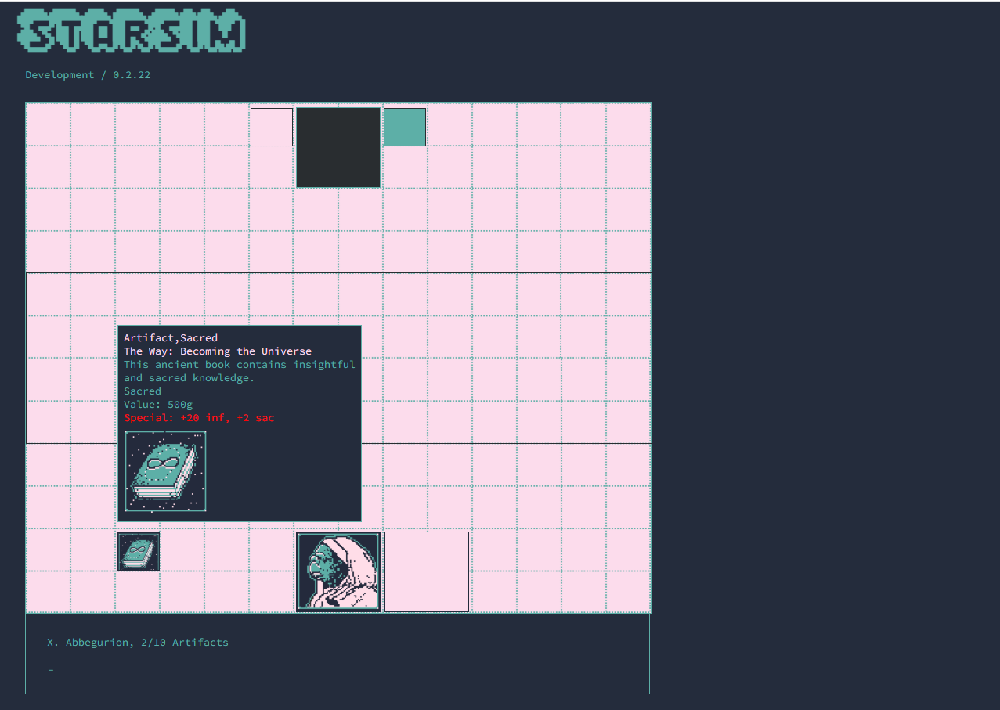

# StarSim (aka Starciety Simulator)
Players must build a colony by controlling objects and artifacts, and recruiting party members to reach a unique society goal, or destroying the other player's base. Each player will start as one of the 5 society leaders. There are over 100 different objects, artifacts, and crew members. All in game objects will pool in the middle of the map and do not have to be controlled or owned by the society they are intended to help, but may have different power and/or value buffs depending on who has them.
- "Golong, The Pirate King" [Pirates] -- buy, sell, find, steal artifacts to make loads of money.
- "Gen. M. Axxelos" [Military] -- buy and collect the most firepower and military.
- "Dr. Lora Basoul" [Scientists] -- collect rare forms of life, study materials to advance society.
- "High  priest, X. Abbegurion" [Theologians] -- collect sacred objects, grow your church, and form a deep connection with teh universe.
- "Pres. W. Halcourt" [Diplomats] -- collect allies, treaties and contracts to make a galactic government.

